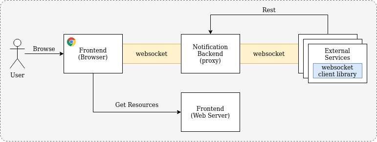
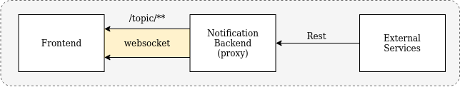
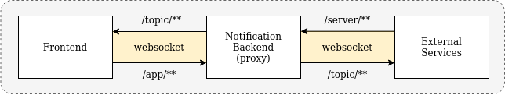

# Websockets Exploration

The project explores development for real time communication between frontend and backend using websockets. **The backend 
acts as a websocket server that provides proxy communications between frontend and other external backend services**. This
is to provide an intermediary layer for basic communication to frontend. The benefits include a higher degree of control
over websocket connections to frontend instead of having individual external backend services establishing their own 
websocket connection to frontend.



- Communications between Frontend and Backend is via **websockets**
- Communications between Backend and external backend services is via **Rest APIs** or **Pub/Sub using websockets**
    - Pub/Sub Model using Message Queue is a good alternative

Below are the use cases for a backend websocket server:

1. **Sending events/messages from external backend services to frontend for real time updates**

    External backend services can send events/messages to the backend websocket server via Rest APIs. These events/messages
    will then be send (proxy) to the frontend via the websocket connection.

    

2. **Real time chat between frontend and external backend services**

    External backend services (Eg. Chat Bot Backend) can communicate with frontend via websocket.

    


## Getting Started

1. Start Frontend
   ```bash
   cd react-app
   npm install
   npm start
   ```
   
2. Start Backend
   ```bash
   cd spring-microservice
   ./gradlew bootrun
   ```

## Custom Topics

To send custom messages, you will have to add a new topic. 


## References

- [Using Stompjs V5](https://stomp-js.github.io/guide/stompjs/using-stompjs-v5.html)

