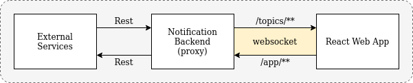

# Websockets Exploration

The project explores development for real time communication between frontend and backend using websockets. The backend
acts as a proxy for handling all messages between frontend and other external services.



## Terminology

- **App Topics** = communications from frontend to backend via websocket. The message may/may not be proxy to external 
services via rest api.
- **Api Topics** = communications from external services to backend via rest api. The message is then proxy from backend 
to frontend via websocket.

## Getting Started

1. Start Frontend
   ```bash
   cd react-app
   npm install
   npm start
   ```
   
2. Start Backend
   ```bash
   cd spring-microservice
   ./gradlew bootrun
   ```
