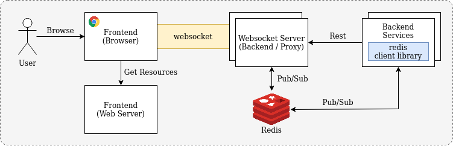
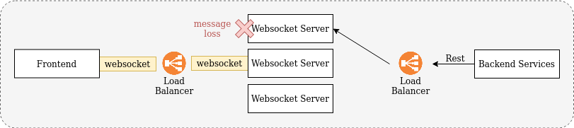

# Websockets Exploration

## Overview

The project explores development for real time communication between frontend and backend using websockets. **The websocket 
server provides proxy communications between frontend and other backend services**. This is to provide an intermediary layer 
for real time communication to frontend. The benefits include a higher degree of control over websocket connections to frontend 
instead of having individual backend services establishing their own websocket connection to frontend.



- Communications between Frontend and Websocket Server is via **websockets**
- Communications between Websocket Server and Backend services is via **Rest APIs** or **Pub/Sub model**

Below are the use cases for the websocket server:

1. **Unidirectional: Sending events/messages from backend services to frontend for real time updates**

    Backend services can send events/messages to the websocket server via Rest APIs. These events/messages will then be 
    send (proxy) to the frontend via the websocket connection.

    

2. **Bidirectional: Real time communications between frontend and backend services**

    Backend services (Eg. Chat Bot Backend) can communicate with frontend via websocket (proxy). *Note that instead of using
    websocket for chats, it might be beneficial to make use of other messaging protocols (Eg. XMPP). However, the concept of 
    the websocket server proxy can still be applied.*

    

## Scaling Websocket Server


The set up above works perfectly fine with a single instance of websocket server. However, when we try to scale up the 
number of websocket server instances, it will result in message loss as shown in the diagram below.



To solve the scalability issue, we make use of a Pub/Sub Model where the webscoket server instance that received the 
event/message will broadcast the event/message to all websocket server instances which will then propagate the event/message 
to the connected frontend client. In our set up below, we make use of Redis Pub/Sub.

**1) Unidirectional Communication from Backend Services to Websocket Server via Rest API**


- Backend services send events/messages to one of the websocket server instance via Rest API
- Websocket server instance broadcast (publish) the events/messages to message broker (Redis) 
- All websocket server receives (subscribe) the events/messages
- All websocket server send (broadcast) events/messages to frontend via websocket

**2) Bidirectional Communication to Websocket Server via Pub/Sub and Websockets**


- Backend to Frontend
    - Backend services send (publish) events/messages to message broker (Redis)
    - All websocket server receives (subscribe) the events/messages
    - All websocket server send (broadcast) events/messages to frontend via websocket
- Frontend to Backend
    - Frontend send (publish) events/messages to one of the websocket server instance via websocket
    - Websocket server instance broadcast (pubish) the events/messages to message broker (Redis)
    - Backend services receives (subscribe) the events/messages

## Getting Started

1. Start Redis
   ```bash
   sudo docker run --name redis -p 6379:6379 -d redis:6.2.6
   ```
   
2. Start Websocket Server
   ```bash
   cd websocket-server
   ../gradlew bootrun
   ```

3. Start Frontend
   ```bash
   cd react-app
   npm install
   npm start
   ```

4. Start the Sample Backend Service
   ```bash
   cd sample-backend-service
   ../gradlew bootrun
   ```

## References & Credits

- [Using Stompjs V5](https://stomp-js.github.io/guide/stompjs/using-stompjs-v5.html)
- [Toptal: Using Spring Boot for Websocket Implementation with STOMP](https://www.toptal.com/java/stomp-spring-boot-websocket)
- [Medium: Building Scalable Facebook like Notification with Server Sent Events and Redis](https://medium.com/javarevisited/building-scalable-facebook-like-notification-using-server-sent-event-and-redis-9d0944dee618)
- [Medium: Websockets with Sprting, Part3: STOMP Over Websocket](https://medium.com/swlh/websockets-with-spring-part-3-stomp-over-websocket-3dab4a21f397)
- [Vinsguru: Spring Boot Redis Pub/Sub](https://www.vinsguru.com/redis-pubsub-spring-boot/)
- [Baeldung: Pub/Sub Messaging with Spring Boot](https://www.baeldung.com/spring-data-redis-pub-sub)
- [Baeldung: Java Spring Client for Websocket APIs](https://www.baeldung.com/websockets-api-java-spring-client)
- [Baeldung: Creating a Custom Starter Library with Spring Boot](https://www.baeldung.com/spring-boot-custom-starter)
- [TowardsDataScience: Guide to use Spring Boot ConfigurationProperties Annotations in Kotlin Data Class](https://towardsdatascience.com/a-guide-to-use-spring-boots-configurationproperties-annotation-in-kotlin-s-dataclass-1341c63110f4)
