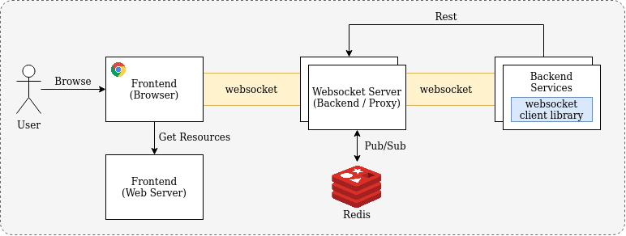
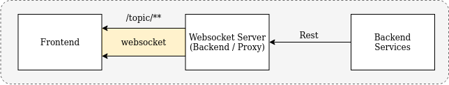
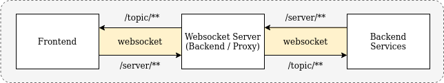

# Websockets Exploration

## Overview

The project explores development for real time communication between frontend and backend using websockets. **The websocket 
server provides proxy communications between frontend and other backend services**. This is to provide an intermediary layer 
for basic communication to frontend. The benefits include a higher degree of control over websocket connections to frontend 
instead of having individual backend services establishing their own websocket connection to frontend.

- Communications between Frontend and Websocket Server is via **websockets**
- Communications between Websocket Server and Backend services is via **Rest APIs** or **websockets**
    - Pub/Sub Model using Message Queue is a good alternative

Below are the use cases for the websocket server:

1. **Sending events/messages from backend services to frontend for real time updates**

    Backend services can send events/messages to the websocket server via Rest APIs. These events/messages will then be 
    send (proxy) to the frontend via the websocket connection.

    

2. **Real time chat between frontend and backend services**

    Backend services (Eg. Chat Bot Backend) can communicate with frontend via websocket (proxy).

    

## Scaling Websocket Server

The set up above works perfectly fine with a single instance of websocket server. However, when we try to scale up the 
number of websocket server instances, it will result in message loss as shown in the diagram below.

To solve the scalability issue, we make use of a Pub/Sub Model where the webscoket server instance that received the 
event/message will broadcast the event/message to all websocket server instances which will then propagate the event/message 
to the connected frontend client. In our set up below, we make use of Redis Pub/Sub.

